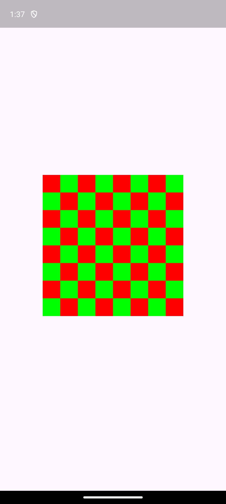

# Android Engine Test

An experimental fork of the [Android Scenario App][] tested using
`flutter_driver`.

See <https://github.com/flutter/flutter/issues/148028> for more information.

[android scenario app]: https://github.com/flutter/engine/tree/main/testing/scenario_app/android

## Usage

Currently the app renders a checkerboard-pattern using the Android platform,
and using the Android embedder plugin model, passes that `textureId` to the
Flutter app, which renders a `Texture` widget. The Flutter app then uses the
`textureId` to render the checkerboard pattern:



To run the app, assuming you're in `dev/integration_tests/android_engine_test`:

```sh
flutter run
```

To run the integration tests:

```sh
flutter drive
```

To update the golden files:

```sh
flutter drive --update-goldens
```

Note that the golden files are currently stored in the `test_driver` directory
for simplicity; for a production release we would use Skia Gold and/or support
multiple platforms as well as multiple configurations similar to `flutter_test`.

## Limitations

The screenshot is currently being taken as-is by `adb shell screencap` by the
test script, which means:

- The navigation bar and device shell (clock) are included in the screenshot.
- An arbitrary duration of 2s is used to wait for the screenshot to be taken.
- No cropping or scaling is done to the screenshot.

In addition, the comparator is currently a simple pixel-by-pixel comparison
without any tolerance or thresholding.

## Changes

Changes required to `flutter/flutter` to make this work:

### `flutter_driver`

No changes are made _directly_ to `flutter_driver` so far.

New experimental APIs were added to [`src/experimental/flutter_driver.dart`](../../../packages/flutter_driver/lib/src/experimental/flutter_driver.dart) which added the
following:

- `matchesGoldenFile` and related classes; similar to what exists in `flutter_test`.

### `flutter_tools`

- Added `--update-goldens` flag to `flutter drive` command.
